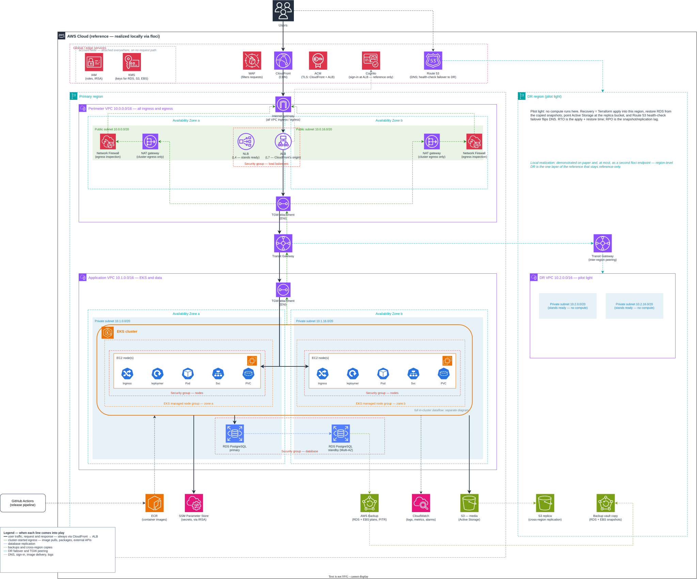

# JDSG-Group6 — Infrastructure

The infrastructure for the [JDSG-Group6 Twitter clone](https://github.com/GauranshMathur/JDSG-Group6-app):
an enterprise AWS architecture as the *reference design*, realized entirely locally.

**This is a proof of concept, and there will never be a real AWS account.** Nothing bills,
nothing deploys to a cloud. The AWS design is drawn as a real account would be, then stood
up against a local emulator ([floci](docs/floci.md)) and a local Kubernetes cluster.



The app repository publishes a container image to GHCR
(`ghcr.io/gauranshmathur/twitter-clone-web`); everything about where that image runs lives
here. That image is the whole interface between the two repositories.

## Documentation

| Document | What is in it |
| --- | --- |
| [Architecture](docs/architecture.md) | The reference design, layer by layer, and how each piece is realized locally |
| [Decisions](docs/decisions.md) | Every decision taken, dated, with what it cost — and the short list still undecided |
| [floci](docs/floci.md) | The emulator: how deep each service goes, and the measured facts |

## Repository layout

```
infra/
├── terraform/        # The reference design as Terraform, verified in CI against floci
├── kubernetes/       # Manifests, cluster-agnostic (not started yet)
└── docker/           # Compose files: the emulator, and PostgreSQL for local dev
.github/workflows/    # CI (lint + security scan), Terraform (apply against floci), diagram render
docs/                 # The three documents above, plus the diagram source
```

## Running things

```bash
# The local AWS emulator
docker compose -f infra/docker/floci-compose.yml up -d

# Apply the Terraform against it (same thing CI does)
cd infra/terraform && terraform init && terraform apply

# PostgreSQL, for when the app moves off SQLite
docker compose -f infra/docker/app-compose.yml up -d
```

## What's next

- The app running on a local k3d cluster — real PostgreSQL, object storage, Traefik.
- Kubernetes manifests under `infra/kubernetes/`, kept cluster-agnostic.
- The remaining Terraform slices — network, EKS, RDS, IAM — one at a time.
- Resiliency demos: rolling deploys under load, node loss, zone loss, HPA.
- Load and latency testing, and the improvement loop it feeds.
